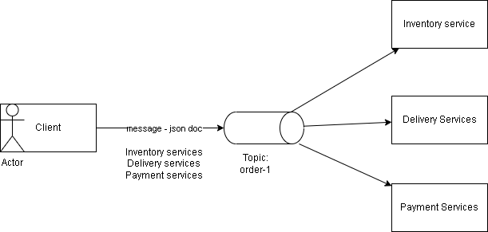
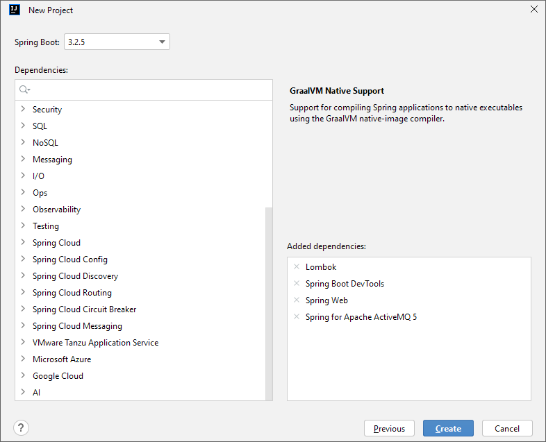

# KTPM_Tuan09: Event-Driven architecture

### Example model

Bên client dùng port 8083, services dùng port 8081

Bên Client định nghĩa một endpoint POST "http://localhost:8083/api/orders/" để nhận dữ liệu đơn hàng dưới dạng JSON sau đó trả về một thông báo cho biết đơn hàng đã được gửi thành công.

Test method post trên postman

Bên Services sẽ lắng nghe các tin nhắn từ message broker sử dụng JMS (Java Message Service).

Bên service sẽ nhận thông tin order dưới dạng chuỗi json

Một tin nhắn được gửi tới chủ đề "processing_order_1".

